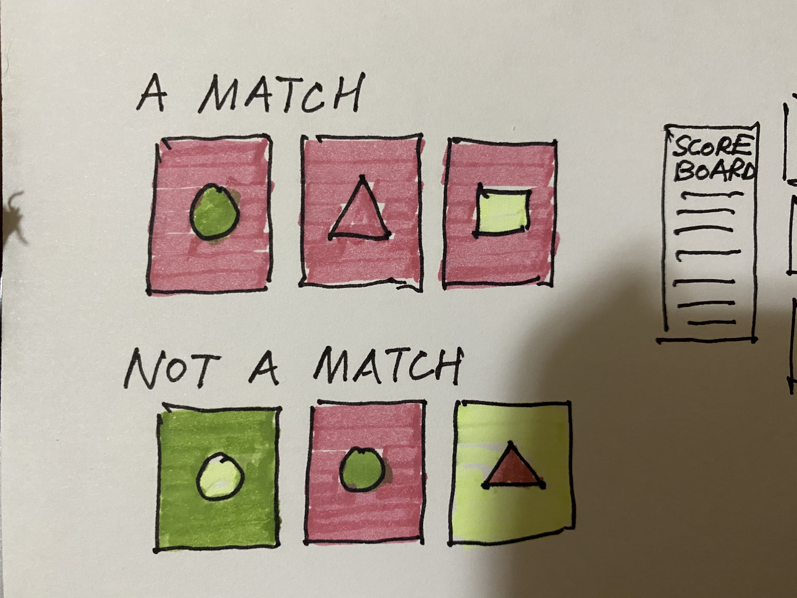
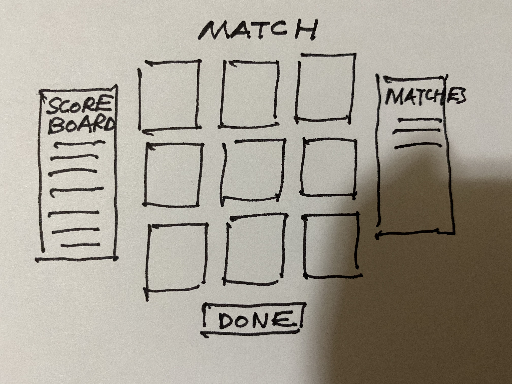

# Project Proposal 

## 1. Background and Overview 
`Match` is inspired by the card game [Set](https://en.wikipedia.org/wiki/Set_(card_game)). There are at most nine cards on the board. The unique cards vary in four features:
  1. Background color (red, yellow, blue, black)
  2. Shape (circle, square, triangle OR moon, star, sun)
  3. The color that fills the shapes (red, yellow, blue, black)

Based on the cards dealt, there are a specified number of qualified matches. A match: when each of the above mentioned features are either a) all the same or b) all different. 

## 2. Functionality and MVPs 
* In Match, the player will be able to play the game by choosing the three cards that they think will make a match. If the match is qualified, the user gets one point, otherwise they lose one point. 
* If the player thinks that there are no longer any matches on the board, they can call Done. If the player calls done accurately (i.e. they have named all the matches for the cards dealt), they attain three points. If a Done is called incorrectly, they will also lose a point. 
* The player's scores across five rounds of varying difficultiness will be totaled. 
* There will a be scoreboard consisted of the highest scores per a given day. 

## 3. Wireframes 

## 4. Architecture and Technology 
Javascript, Canvas 

## 5. Implementation Timeline 
* Day 1, 2 - Board, cards, math to solve solutions depending on cards dealt
* Day 3 - Frontend, website layout
* Day 4, 5 - User interface and experience (how the player input matches, etc.)

## 6. (Bonus Features)
Mobile version of the app
