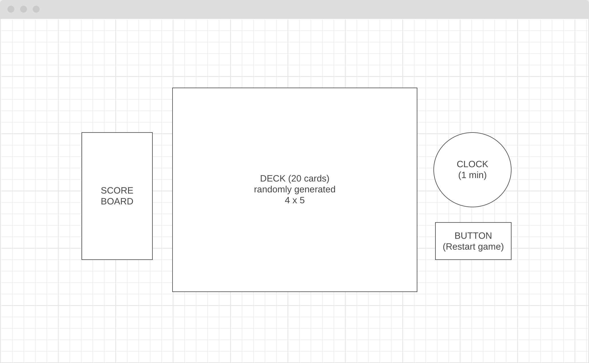

# Project Proposal 

## Background and Overview 
`Match!` is inspired by the card game [Set](https://en.wikipedia.org/wiki/Set_(card_game)). A deck consists of 16 randomly generated cards. The unique cards vary in four features:
  1. `Background color` (e.g. red, yellow, blue, black)
  2. `Shape` (e.g. circle, square, triangle OR moon, star, sun)
  3. `The color that fills the shapes` (e.g. red, yellow, blue, black)

A match consists of three cards with the above mentioned features that are either **a) all the same** or **b) all different**. 

## Functionality and MVPs 
* `Making a match` Player can pick up to three cards they think will make a match. 
  Player will get one point per correct match. 
  Alerts will pop up to let the player know if the match is not an answer or has already been chosen.
* `Timer` Player will have one minute to come up with as many matches as possible. 
* `Score Board` One point will be awarded per successful match. 

## Wireframes 

  |  
:-------------------------:|:-------------------------:
landing page | game screen

## Architecture and Technology 
Javascript, HTML and CSS

## Implementation Timeline 
* Day 1 - Game logic
* Day 2 - Render card and deck 
* Day 3 - Timer and score board 
* Day 4 - User interface and experience 
* Day 5 - Clean up for deployment

## Bonus Features
* User can choose how cards in a deck (Difficulty levels)
* More elaborate game instructions
* Option to skip game instructions
* Zen mode without timer
* Alert for when all possible matches are found
* User can see all the matches they have found 
* User knows when there are no more possible matches
